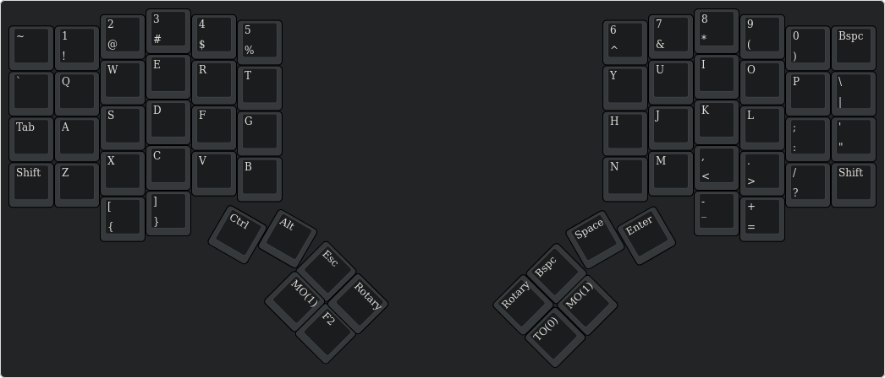
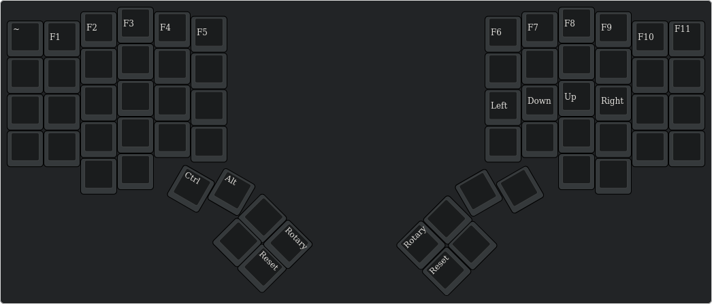
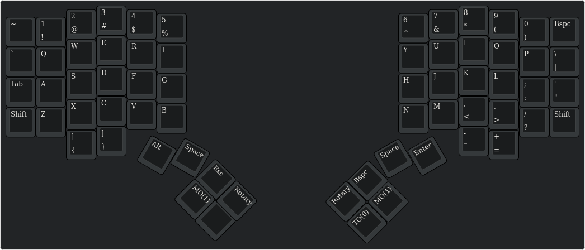

# simulacra-DM
Dactyl Manuform - Simulacra edition

## Bill of materials

## Setup

### Setup QMK build enviroment
1. Setup QMK build environment https://beta.docs.qmk.fm/tutorial/newbs_getting_started#linux-wsl
2. Move simulacra folder into `qmk_firmware/keyboards/handwired/`

### Firmware
Compile and flash the firmware to each side of the keyboard.

After flashing for the first time the Func layer contains a RESET key for each side of the keyboard.
#### Compile firmware
`qmk compile -kb handwired/simulacra -km default -e PREPROCESSOR=RIGHT`

`qmk compile -kb handwired/simulacra -km default -e PREPROCESSOR=LEFT`

#### Flashing firmware
`qmk flash -kb handwired/simulacra -km default -bl dfu-split-right`

`qmk flash -kb handwired/simulacra -km default -bl dfu-split-left`

## Keyboard Layout
#### [_QWERTY] = LAYOUT

#### [_FUNC] = LAYOUT

#### [_GAMING] = LAYOUT

